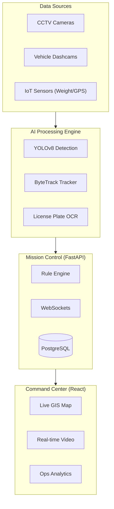

# Smart Waste Management System (SWMS) 🗑️🤖

### AI-Powered Urban Waste Monitoring & Analytics Platform

[](https://opensource.org/licenses/MIT)
[](https://www.python.org/downloads/)
[](https://reactjs.org/)
[](https://tailwindcss.com/)
[](https://www.nvidia.com/en-us/autonomous-machines/embedded-systems/jetson-orin/)

---

## 🌟 Overview

The **Smart Waste Management System (SWMS)** is a high-fidelity, AI-driven platform designed to revolutionize urban sanitation. By leveraging computer vision (YOLOv8), real-time data fusion, and a "Cyber-Ops" styled dashboard, the system automates waste detection, vehicle monitoring, and maintenance ticketing with zero human intervention.

Designed for scalability, the system targets deployment on edge devices like the **NVIDIA Jetson Orin Nano**, making it suitable for vehicle-mounted cameras and fixed urban CCTV installations.

---

## 🚀 Key Features

- **🧠 Edge-AI Detection**: Real-time object detection using YOLOv8, optimized with TensorRT for high-FPS inference on NVIDIA hardware.
- **🛰️ Smart Geofencing**: Automatically validates waste pickups by analyzing vehicle dwell time within predefined GPS collection zones.
- **📈 Spatial Heatmaps**: Generates dynamic garbage density maps from dashcam feeds to identify illegal dumping hotspots.
- **🤖 Auto-Ticketing**: Zero-human-intervention ticket creation. AI detects waste, logs location, and assigns the nearest crew.
- **📺 Live Mission Control**: A premium industrial dashboard featuring WebSocket-driven live video feeds and real-time operational analytics.
- **⚖️ IoT Data Fusion**: Integrates with weighbridge sensors and OCR to validate vehicle loads and enforce weight tiers.

---

## 🏗️ System Architecture



---

## 🛠️ Technology Stack

| Layer | Technology |
| :--- | :--- |
| **Frontend** | React 18, Vite, Tailwind CSS, Leaflet.js, Recharts |
| **Backend** | Python 3.11, FastAPI, WebSockets |
| **AI/CV** | YOLOv8 (Ultralytics), OpenCV, ByteTrack, EasyOCR |
| **Database** | PostgreSQL (Persistent), Redis (Real-time State) |
| **Edge** | TensorRT, NVIDIA Jetson Orin Nano Super |

---

## 📂 Project Structure

```text
├── backend/                # FastAPI Application & AI Logic
│   ├── ai/                 # YOLOv8 Inference & Tracking Logic
│   ├── app/                # API Routers, Schemas, & CRUD
│   └── main.py             # API Entry Point
├── frontend/               # React Application (Cyber-Ops UI)
│   ├── src/pages/          # Admin Panel & Worker Portal
│   ├── src/components/     # Map & Analytics Components
│   └── tailwind.config.js  # Industrial Theme Configuration
├── run_server.py           # Unified Launch Script (API + Frontend)
├── run_detection.py        # Independent AI Inference Engine
└── SMART_WASTE_MANAGEMENT_PLAN.md # Detailed Implementation Roadmap
```

---

## 🚀 Getting Started

### Prerequisites
- Python 3.11+
- Node.js 18+
- NVIDIA GPU (Optional, recommended for TensorRT optimization)

### Installation

1. **Clone the Repository**:
   ```bash
   git clone https://github.com/Rudra-Gupta15/Smart-waste-monitoring-system.git
   cd Smart-waste-monitoring-system
   ```

2. **Setup Backend**:
   ```bash
   python -m venv venv
   source venv/bin/activate  # Windows: .\venv\Scripts\activate
   pip install -r backend/requirements.txt
   ```

3. **Setup Frontend**:
   ```bash
   cd frontend
   npm install
   cd ..
   ```

4. **Initialize AI Weights**:
   Download `yolov8m.pt` and place it in the root directory.

### Running the System
```bash
python run_server.py
```
- **Dashboard**: `http://localhost:5173`
- **Worker Portal**: `http://localhost:5173/worker`
- **API Docs**: `http://localhost:8000/docs`

---

## 🖥️ Edge Deployment (NVIDIA Jetson)

The system is optimized for the **NVIDIA Jetson Orin Nano Super**. To achieve maximum throughput:

1. **Export to TensorRT**:
   ```python
   from ultralytics import YOLO
   model = YOLO('yolov8m.pt')
   model.export(format='engine', device=0)
   ```
2. **Requirements**: 8GB RAM, M.2 NVMe SSD, IMX219 CSI or USB 3.0 Cameras.

---

## 📄 License

Licensed under the **MIT License**. Developed by [Rudra Gupta](https://github.com/Rudra-Gupta15).
