# Smart Waste Management System

## AI-Powered Urban Waste Monitoring & Analytics Platform

---

## Table of Contents

- [1. Executive Summary](#1-executive-summary)
- [2. System Architecture](#2-system-architecture)
- [3. Technology Stack](#3-technology-stack)
- [4. Implementation Plan](#4-implementation-plan)
- [5. Use Case 1 — Household Waste Vehicle Pickup Monitoring](#5-use-case-1--household-waste-vehicle-pickup-monitoring)
- [6. Use Case 2 — AI-Driven Transfer Station Vehicle Monitoring](#6-use-case-2--ai-driven-transfer-station-vehicle-monitoring)
- [7. Use Case 3 — Weighbridge Entry Validation & Tier Weight Monitoring](#7-use-case-3--weighbridge-entry-validation--tier-weight-monitoring)
- [8. Use Case 4 — Street Garbage Monitoring from Vehicle-Mounted Cameras](#8-use-case-4--street-garbage-monitoring-from-vehicle-mounted-cameras)
- [9. Use Case 5 — Auto Ticket Creation from Video Analytics](#9-use-case-5--auto-ticket-creation-from-video-analytics)
- [10. Dashboard Design](#10-dashboard-design)
- [11. Database Schema Overview](#11-database-schema-overview)
- [12. API Endpoints](#12-api-endpoints)
- [13. Deployment Strategy](#13-deployment-strategy)

---

## 1. Executive Summary

The **Smart Waste Management System** is an AI-powered platform that leverages computer vision, IoT integration, and real-time analytics to revolutionize urban waste collection and monitoring. The system processes live video feeds from fixed cameras and vehicle-mounted dashcams, fuses data with IoT sensors (weighbridges, GPS, RFID), and delivers actionable intelligence through a centralized dashboard.

### Core Objectives

| Objective | Description |
|-----------|-------------|
| **Automate Monitoring** | Replace manual supervision with AI-driven video analytics |
| **Real-Time Visibility** | Live tracking of vehicles, pickups, and garbage hotspots |
| **Intelligent Alerting** | Auto-detect anomalies — missed pickups, overweight vehicles, illegal dumping |
| **Automated Ticketing** | Zero-human-intervention ticket creation for garbage incidents |
| **Data-Driven Decisions** | Analytics dashboards for route optimization and resource planning |

### Evaluation Criteria (40 Marks)

| Component | Marks |
|-----------|-------|
| Concept Presentation | 5 |
| Implementation Plan | 5 |
| Dashboard Design | 5 |
| UC1 — Household Pickup Monitoring | 5 |
| UC2 — Transfer Station Monitoring | 5 |
| UC3 — Weighbridge Validation | 5 |
| UC4 — Street Garbage Detection | 5 |
| UC5 — Auto Ticket Creation | 5 |
| **Total** | **40** |

---

## 2. System Architecture

### High-Level Architecture

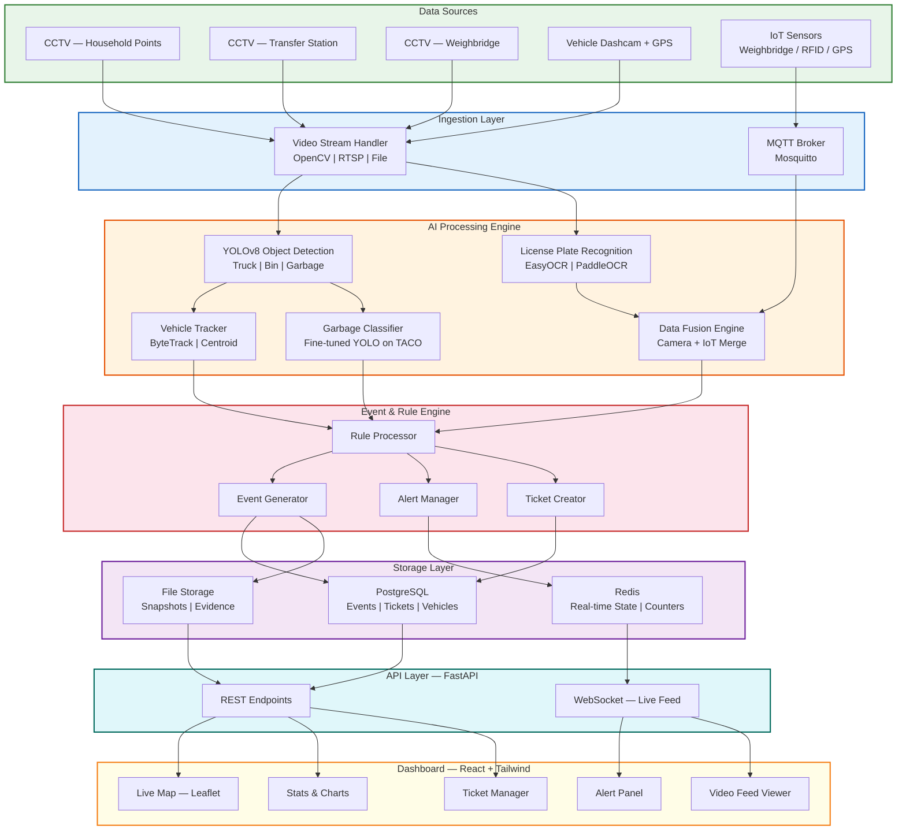

### End-to-End Data Flow

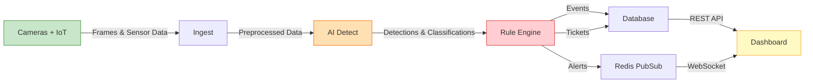

---

## 3. Technology Stack

| Layer | Technology | Purpose |
|-------|-----------|---------|
| **Frontend** | React 18 + Tailwind CSS | Dashboard UI |
| **Maps** | Leaflet / Mapbox GL | Live map, heatmaps, geofencing |
| **Charts** | Chart.js / Recharts | Analytics & reporting |
| **Backend** | Python 3.11 + FastAPI | REST API + WebSocket server |
| **AI / CV** | YOLOv8 (Ultralytics) | Object detection — trucks, bins, garbage |
| **Tracking** | ByteTrack / SORT | Multi-object tracking across frames |
| **OCR** | EasyOCR / PaddleOCR | License plate recognition |
| **Video** | OpenCV 4.x | Video capture, frame processing, drawing |
| **IoT** | MQTT (Mosquitto) | Sensor data ingestion — weight, GPS, RFID |
| **Database** | PostgreSQL 16 | Persistent storage — events, tickets, vehicles |
| **Cache** | Redis 7 | Real-time state, pub/sub for live updates |
| **Storage** | Local / S3 | Snapshots, evidence images, video clips |
| **Deployment** | Docker + Docker Compose | Containerized services |

### AI Models Required

| Model | Base | Training Data | Purpose |
|-------|------|--------------|---------|
| Vehicle Detector | YOLOv8m | COCO (pre-trained) | Detect trucks, vans, compactors |
| Garbage Detector | YOLOv8m | TACO Dataset | Detect litter, bags, piles, bins |
| Plate Reader | EasyOCR | Pre-trained | Read license plate text |
| Vehicle Classifier | Custom CNN | Transfer station data | Classify vehicle type and tier |

---

## 4. Implementation Plan

### Phase-wise Roadmap

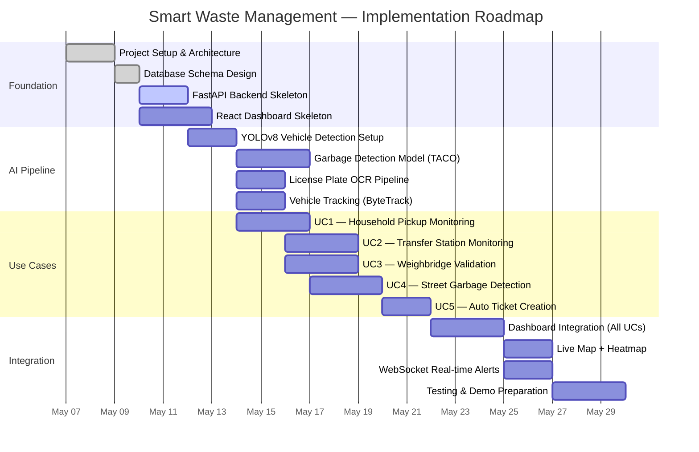

### Build Priority Order

| Priority | Component | Rationale |
|----------|-----------|-----------|
| 1 | Dashboard Skeleton | Immediate visual output for demo |
| 2 | UC1 — Pickup Monitoring | Simplest detection (truck in frame) |
| 3 | UC4 + UC5 — Garbage + Tickets | High demo impact, tightly coupled |
| 4 | UC2 — Transfer Station | Entry/exit counting logic |
| 5 | UC3 — Weighbridge | Most complex (IoT + OCR fusion) |

---

## 5. Use Case 1 — Household Waste Vehicle Pickup Monitoring

### Objective

Monitor fixed cameras at household collection points to detect whether waste vehicles arrived and performed pickups.

### Functional Flow

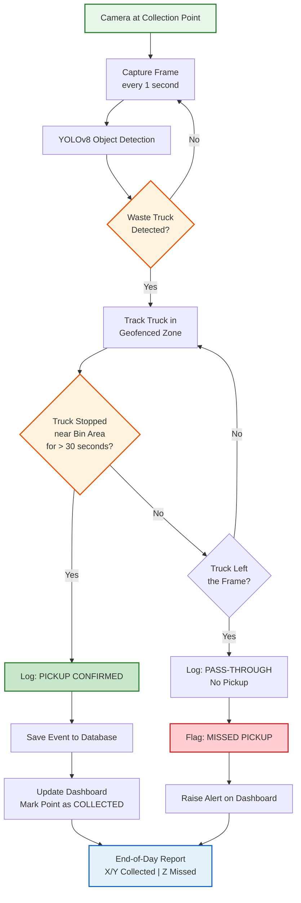

### Detection Logic

```mermaid
sequenceDiagram
    participant Camera
    participant OpenCV as OpenCV Processor
    participant YOLO as YOLOv8 Model
    participant Tracker as Zone Tracker
    participant DB as Database
    participant Dash as Dashboard

    loop Every 1 Second
        Camera->>OpenCV: Raw Frame
        OpenCV->>YOLO: Preprocessed Frame
        YOLO->>OpenCV: Detections [truck, bin, person...]
    end

    OpenCV->>Tracker: Truck detected at (x, y)
    Tracker->>Tracker: Check if (x,y) is in geofenced pickup zone
    Tracker->>Tracker: Monitor dwell time

    alt Dwell > 30s (Pickup)
        Tracker->>DB: INSERT pickup_event
        DB->>Dash: Update collection status
        Dash->>Dash: Mark GREEN on map
    else Truck leaves without stopping
        Tracker->>DB: INSERT missed_event
        DB->>Dash: Raise MISSED alert
        Dash->>Dash: Mark RED on map
    end
```

### Event Data Model

```json
{
  "event_id": "EVT-20260507-001",
  "type": "PICKUP_CONFIRMED",
  "collection_point_id": "CP-MG-042",
  "collection_point_name": "MG Road — Block A",
  "vehicle_detected": true,
  "vehicle_class": "compactor_truck",
  "arrival_time": "2026-05-07T06:32:15Z",
  "departure_time": "2026-05-07T06:34:48Z",
  "dwell_duration_seconds": 153,
  "pickup_confirmed": true,
  "confidence": 0.92,
  "snapshot_url": "/evidence/evt-20260507-001.jpg"
}
```

---

## 6. Use Case 2 — AI-Driven Transfer Station Vehicle Monitoring

### Objective

Track vehicles entering and exiting waste transfer stations — count, classify, measure dwell time, and detect anomalies.

### Functional Flow

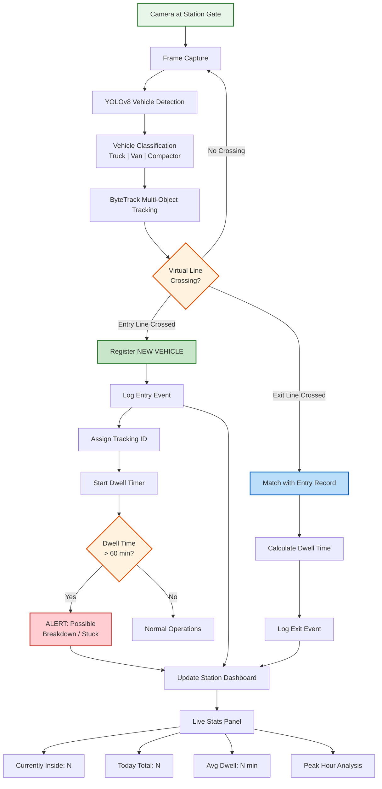

### Virtual Line Crossing Logic

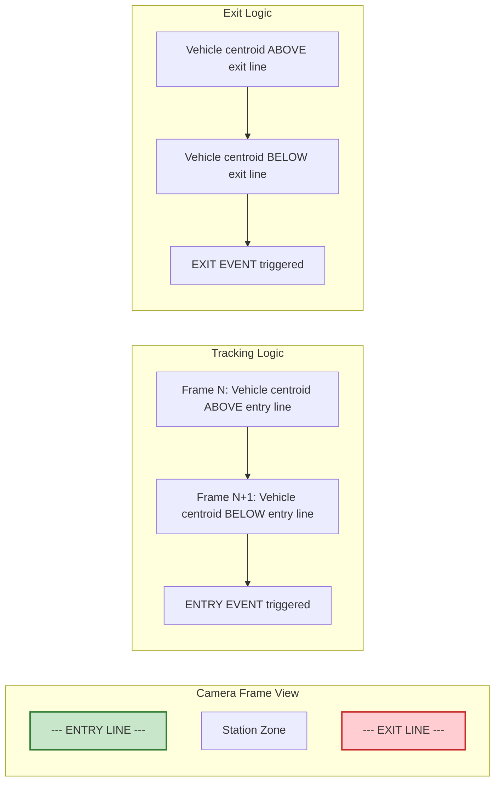

### Station Monitoring Data Model

```json
{
  "station_id": "TS-CENTRAL-01",
  "vehicle_tracking_id": "TRK-20260507-014",
  "vehicle_type": "heavy_compactor",
  "license_plate": "KA01AB1234",
  "entry_time": "2026-05-07T09:15:32Z",
  "exit_time": "2026-05-07T09:42:18Z",
  "dwell_minutes": 26.8,
  "entry_snapshot": "/evidence/trk-014-entry.jpg",
  "exit_snapshot": "/evidence/trk-014-exit.jpg",
  "status": "DEPARTED",
  "alerts": []
}
```

---

## 7. Use Case 3 — Weighbridge Entry Validation & Tier Weight Monitoring

### Objective

Validate vehicle identity at the weighbridge using camera-based plate recognition, fuse with IoT weight sensor data, and enforce tier-based weight limits.

### Weight Tier Definitions

| Tier | Vehicle Type | Weight Range | Action on Exceed |
|------|-------------|-------------|-----------------|
| Tier 1 | Small Van / Auto | 0 — 3,000 kg | Alert + Block |
| Tier 2 | Medium Truck | 3,000 — 8,000 kg | Alert + Block |
| Tier 3 | Heavy Compactor | 8,000 — 15,000 kg | Alert + Block |
| Unregistered | Unknown | Any | Deny Entry |

### Functional Flow

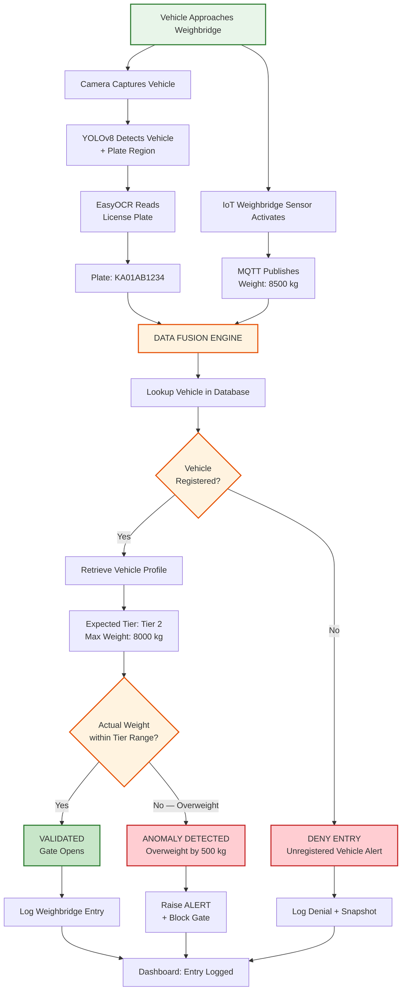

### Camera + IoT Fusion Sequence

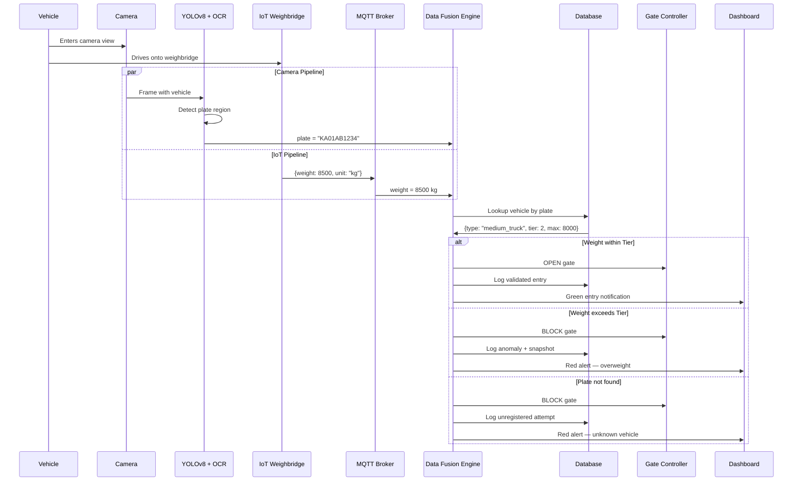

### Weighbridge Entry Data Model

```json
{
  "entry_id": "WB-20260507-009",
  "weighbridge_id": "WB-NORTH-01",
  "license_plate": "KA01AB1234",
  "plate_confidence": 0.95,
  "vehicle_type": "medium_truck",
  "expected_tier": 2,
  "tier_max_weight_kg": 8000,
  "actual_weight_kg": 8500,
  "weight_difference_kg": 500,
  "validation_status": "OVERWEIGHT",
  "gate_action": "BLOCKED",
  "entry_snapshot": "/evidence/wb-009-plate.jpg",
  "timestamp": "2026-05-07T10:15:42Z",
  "alert_raised": true
}
```

---

## 8. Use Case 4 — Street Garbage Monitoring from Vehicle-Mounted Cameras

### Objective

Detect garbage, litter, and overflowing bins from dashcam footage on waste transport vehicles. Tag detections with GPS coordinates and generate a city-wide garbage heatmap.

### Detection Categories

| Category | Examples | Severity Mapping |
|----------|----------|-----------------|
| **Litter** | Bottles, wrappers, cups | LOW |
| **Bags** | Plastic bags, trash bags on street | MEDIUM |
| **Pile** | Large garbage pile, dumped waste | HIGH |
| **Overflowing Bin** | Bin with garbage spilling out | MEDIUM |
| **Illegal Dump** | Construction debris, bulk waste | CRITICAL |

### Functional Flow

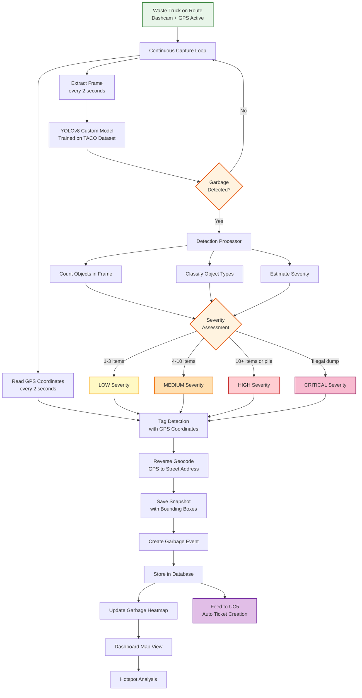

### Vehicle Route Processing Pipeline

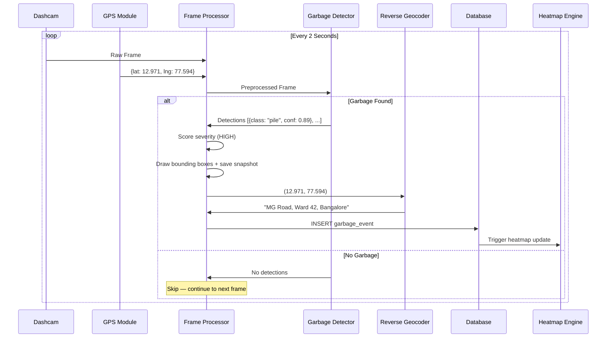

### Garbage Event Data Model

```json
{
  "event_id": "GRB-20260507-037",
  "vehicle_id": "TRUCK-KA01-7842",
  "route_id": "ROUTE-SOUTH-05",
  "location": {
    "latitude": 12.9716,
    "longitude": 77.5946,
    "address": "MG Road, Ward 42, Bangalore",
    "ward": "Ward 42",
    "zone": "South Zone"
  },
  "detections": [
    {"class": "garbage_pile", "confidence": 0.91, "bbox": [120, 340, 480, 520]},
    {"class": "plastic_bag", "confidence": 0.87, "bbox": [510, 380, 590, 440]},
    {"class": "plastic_bag", "confidence": 0.82, "bbox": [320, 410, 380, 460]}
  ],
  "severity": "HIGH",
  "object_count": 3,
  "snapshot_url": "/evidence/grb-037-annotated.jpg",
  "timestamp": "2026-05-07T10:32:00Z",
  "ticket_created": true,
  "ticket_id": "TKT-20260507-019"
}
```

---

## 9. Use Case 5 — Auto Ticket Creation from Video Analytics

### Objective

Automatically generate cleanup tickets when garbage is detected (from UC4 or any source), with de-duplication, severity-based prioritization, and crew assignment.

### Ticket Lifecycle

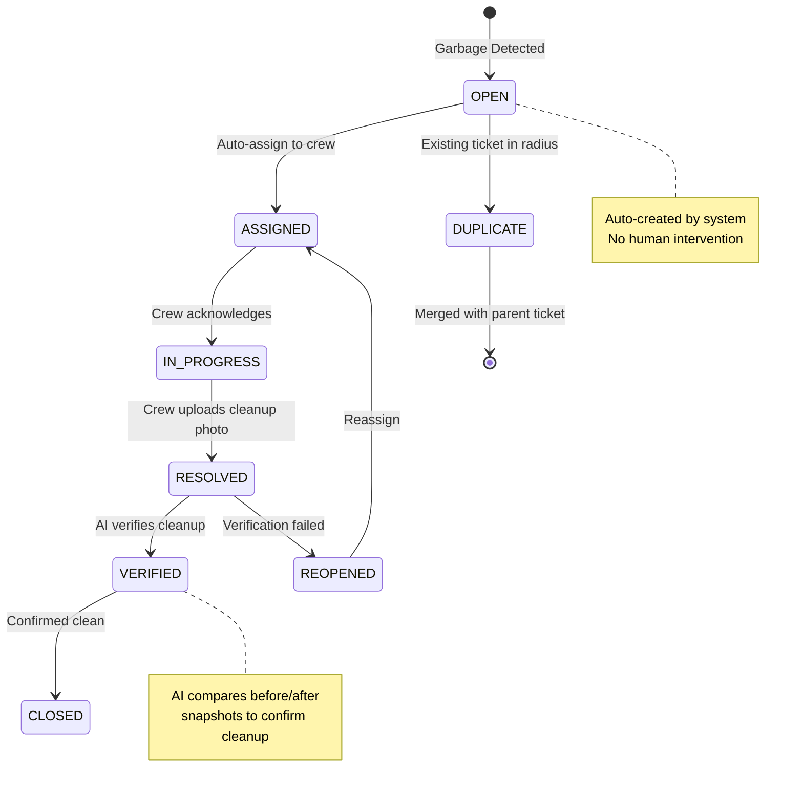

### Functional Flow

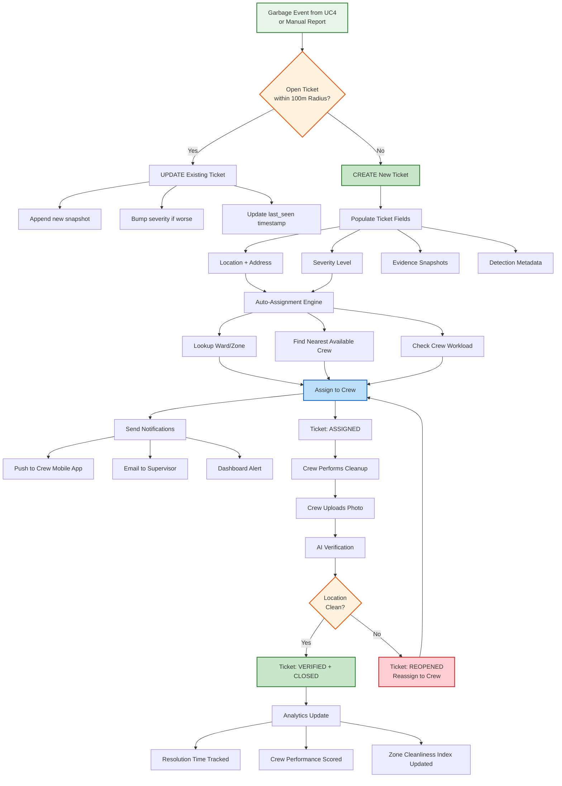

### De-duplication Logic

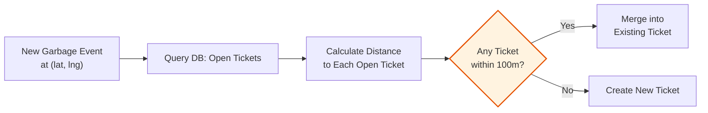

### Ticket Data Model

```json
{
  "ticket_id": "TKT-20260507-019",
  "source": "AUTO_DETECTION",
  "source_event_ids": ["GRB-20260507-037", "GRB-20260507-041"],
  "location": {
    "latitude": 12.9716,
    "longitude": 77.5946,
    "address": "MG Road, Ward 42, Bangalore",
    "ward": "Ward 42",
    "zone": "South Zone"
  },
  "severity": "HIGH",
  "priority": 1,
  "status": "ASSIGNED",
  "assigned_crew": {
    "crew_id": "CREW-SOUTH-12",
    "crew_name": "South Zone Team 12",
    "assigned_at": "2026-05-07T10:33:15Z"
  },
  "evidence": [
    {
      "snapshot_url": "/evidence/grb-037-annotated.jpg",
      "captured_at": "2026-05-07T10:32:00Z",
      "type": "DETECTION"
    }
  ],
  "created_at": "2026-05-07T10:32:05Z",
  "updated_at": "2026-05-07T10:33:15Z",
  "resolved_at": null,
  "resolution_photo_url": null,
  "sla_deadline": "2026-05-07T14:32:05Z",
  "sla_hours": 4
}
```

---

## 10. Dashboard Design

### Layout Architecture

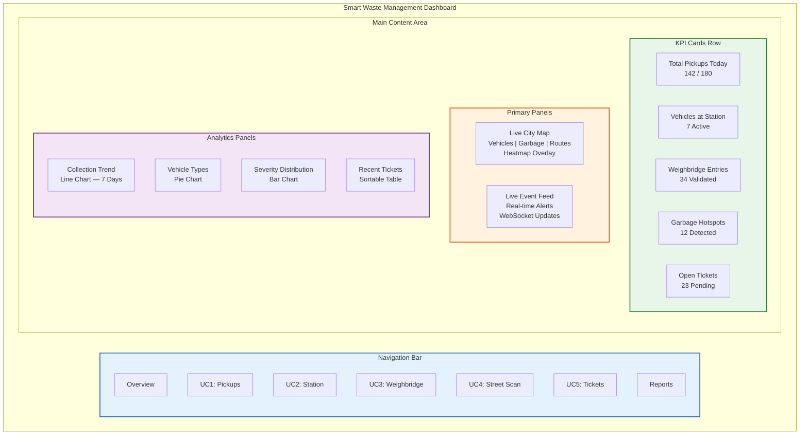

### Dashboard Pages per Use Case

| Page | Key Components |
|------|---------------|
| **Overview** | KPI cards, city map with all layers, alert feed, summary charts |
| **UC1 — Pickups** | Collection points map (green/red), pickup timeline, daily completion % |
| **UC2 — Station** | Station camera feed, vehicle table (in/out), dwell time chart, capacity gauge |
| **UC3 — Weighbridge** | Live weighbridge feed, plate recognition display, weight log table, anomaly alerts |
| **UC4 — Street Scan** | Route map with garbage pins, heatmap toggle, severity filter, detection gallery |
| **UC5 — Tickets** | Ticket board (Kanban: Open/Assigned/Resolved), ticket detail modal, SLA tracker |
| **Reports** | Date range filters, exportable PDF, zone-wise analytics, crew performance |

---

## 11. Database Schema Overview

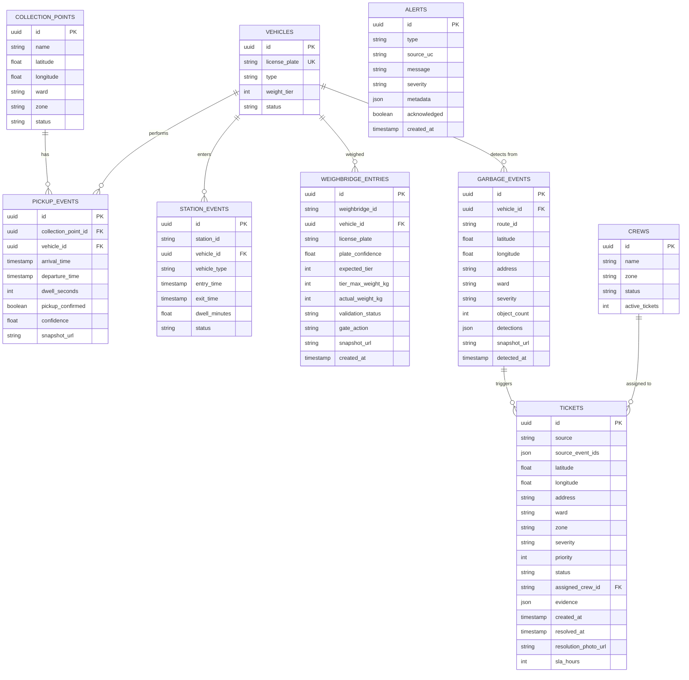

---

## 12. API Endpoints

### Core REST Endpoints

| Method | Endpoint | Description |
|--------|----------|-------------|
| `GET` | `/api/dashboard/stats` | KPI summary for all use cases |
| `GET` | `/api/dashboard/alerts` | Recent alerts with filters |
| `GET` | `/api/collections/points` | All collection points with status |
| `GET` | `/api/collections/events` | Pickup events with filters |
| `GET` | `/api/station/vehicles` | Current vehicles at station |
| `GET` | `/api/station/history` | Station entry/exit history |
| `GET` | `/api/weighbridge/entries` | Weighbridge entry log |
| `GET` | `/api/weighbridge/anomalies` | Flagged weight anomalies |
| `GET` | `/api/garbage/events` | Garbage detection events |
| `GET` | `/api/garbage/heatmap` | Aggregated heatmap data |
| `GET` | `/api/tickets` | All tickets with filters |
| `GET` | `/api/tickets/{id}` | Single ticket detail |
| `PATCH` | `/api/tickets/{id}/status` | Update ticket status |
| `POST` | `/api/tickets/{id}/resolve` | Mark ticket as resolved |
| `GET` | `/api/vehicles` | Registered vehicles |
| `GET` | `/api/crews` | Crew list and workload |
| `GET` | `/api/reports/daily` | Daily summary report |

### WebSocket Endpoints

| Endpoint | Purpose |
|----------|---------|
| `ws://host/ws/live-events` | Real-time event stream (all use cases) |
| `ws://host/ws/alerts` | Live alert notifications |
| `ws://host/ws/vehicle-tracking` | Live vehicle positions |

---

## 13. Deployment Strategy

### Docker Compose Architecture

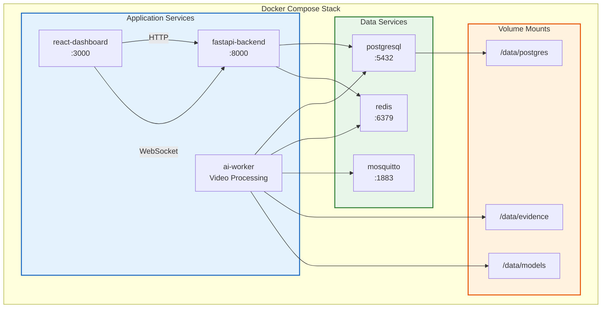

### Folder Structure

```
smart-waste-management/
├── backend/
│   ├── app/
│   │   ├── main.py                 # FastAPI entry point
│   │   ├── config.py               # Settings & environment
│   │   ├── models/                 # SQLAlchemy models
│   │   ├── schemas/                # Pydantic schemas
│   │   ├── routers/                # API route handlers
│   │   │   ├── dashboard.py
│   │   │   ├── collections.py      # UC1
│   │   │   ├── station.py          # UC2
│   │   │   ├── weighbridge.py      # UC3
│   │   │   ├── garbage.py          # UC4
│   │   │   └── tickets.py          # UC5
│   │   ├── services/               # Business logic
│   │   └── websocket/              # WebSocket handlers
│   ├── ai/
│   │   ├── detector.py             # YOLOv8 inference wrapper
│   │   ├── tracker.py              # ByteTrack vehicle tracking
│   │   ├── plate_reader.py         # License plate OCR
│   │   ├── garbage_classifier.py   # Garbage severity scoring
│   │   └── models/                 # Trained model weights
│   ├── iot/
│   │   ├── mqtt_client.py          # MQTT subscriber
│   │   └── simulator.py            # IoT data simulator
│   ├── requirements.txt
│   └── Dockerfile
├── frontend/
│   ├── src/
│   │   ├── App.jsx
│   │   ├── pages/
│   │   │   ├── Dashboard.jsx
│   │   │   ├── Pickups.jsx         # UC1
│   │   │   ├── Station.jsx         # UC2
│   │   │   ├── Weighbridge.jsx     # UC3
│   │   │   ├── StreetScan.jsx      # UC4
│   │   │   └── Tickets.jsx         # UC5
│   │   ├── components/
│   │   │   ├── MapView.jsx
│   │   │   ├── StatsCard.jsx
│   │   │   ├── AlertFeed.jsx
│   │   │   ├── TicketBoard.jsx
│   │   │   └── VideoPlayer.jsx
│   │   └── services/
│   │       ├── api.js
│   │       └── websocket.js
│   ├── package.json
│   └── Dockerfile
├── docker-compose.yml
├── SMART_WASTE_MANAGEMENT_PLAN.md
└── README.md
```

---

> **Document Version:** 1.0
> **Last Updated:** 2026-05-07
> **Status:** Planning & Design Phase
